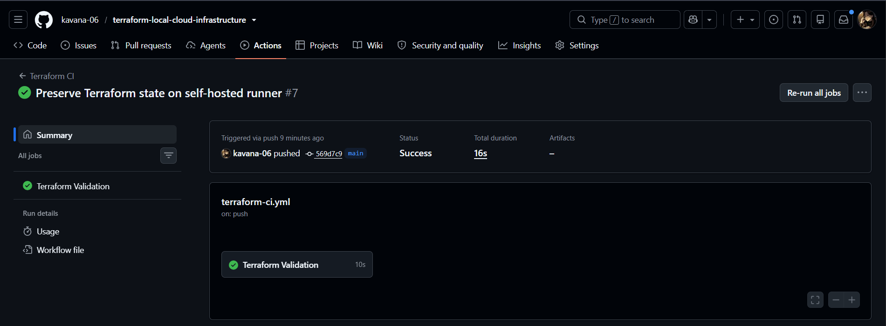
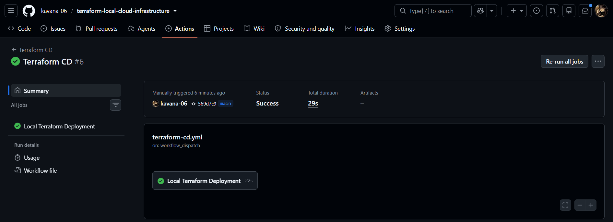
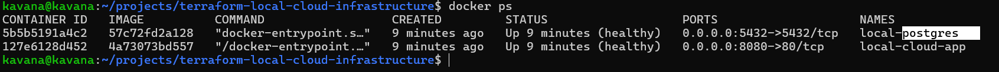
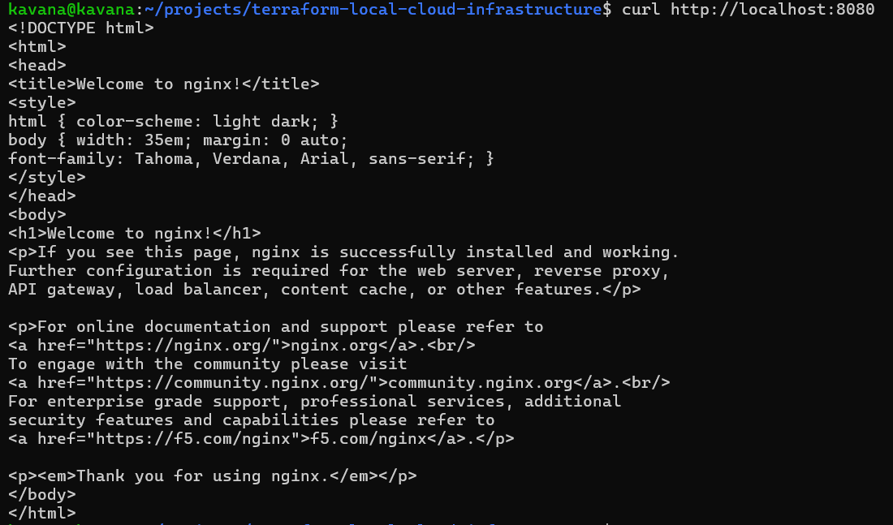

# Terraform Local Cloud Infrastructure


Infrastructure as Code project that provisions and manages a local cloud-style environment using Terraform, Docker, and GitHub Actions.

## Overview

This project demonstrates how cloud infrastructure and DevOps practices can be implemented locally without using a paid cloud account.

Terraform declaratively provisions and manages Docker-based infrastructure, while GitHub Actions provides automated CI validation and CD deployment through a self-hosted runner.

The environment includes:

- Docker bridge networking
- Secure internal Docker network
- Nginx application container
- PostgreSQL database container
- Terraform modules
- Terraform outputs
- Terraform CI validation
- Terraform CD deployment
- Self-hosted GitHub Actions runner
- Automated application verification

## Architecture

```text
                         GitHub Repository
                                |
                                v
                     +----------------------+
                     |   GitHub Actions     |
                     |                      |
                     | Terraform CI        |
                     | Format / Validate    |
                     | Plan                 |
                     +----------+-----------+
                                |
                                v
                     +----------------------+
                     | Self-Hosted Runner   |
                     |       Linux          |
                     +----------+-----------+
                                |
                                v
                         +-------------+
                         |  Terraform  |
                         +------+------+
                                |
                                v
                         +-------------+
                         |    Docker   |
                         +------+------+
                                |
              +-----------------+-----------------+
              |                                   |
              v                                   v
     +-------------------+              +-------------------+
     | Nginx Application |              |    PostgreSQL     |
     | local-cloud-app   |              |  local-postgres   |
     |     :8080         |              |      :5432        |
     +---------+---------+              +---------+---------+
              |                                   |
              +---------------+-------------------+
                              |
                              v
                     Docker Networks
---

## CI/CD Evidence

### Terraform CI



### Terraform CD



### Docker Containers



### Application


